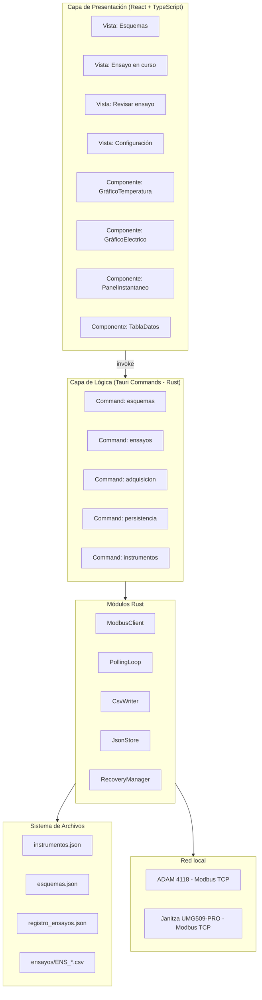
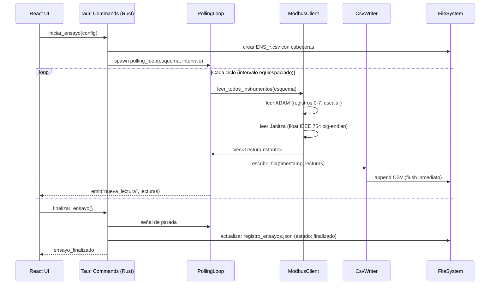
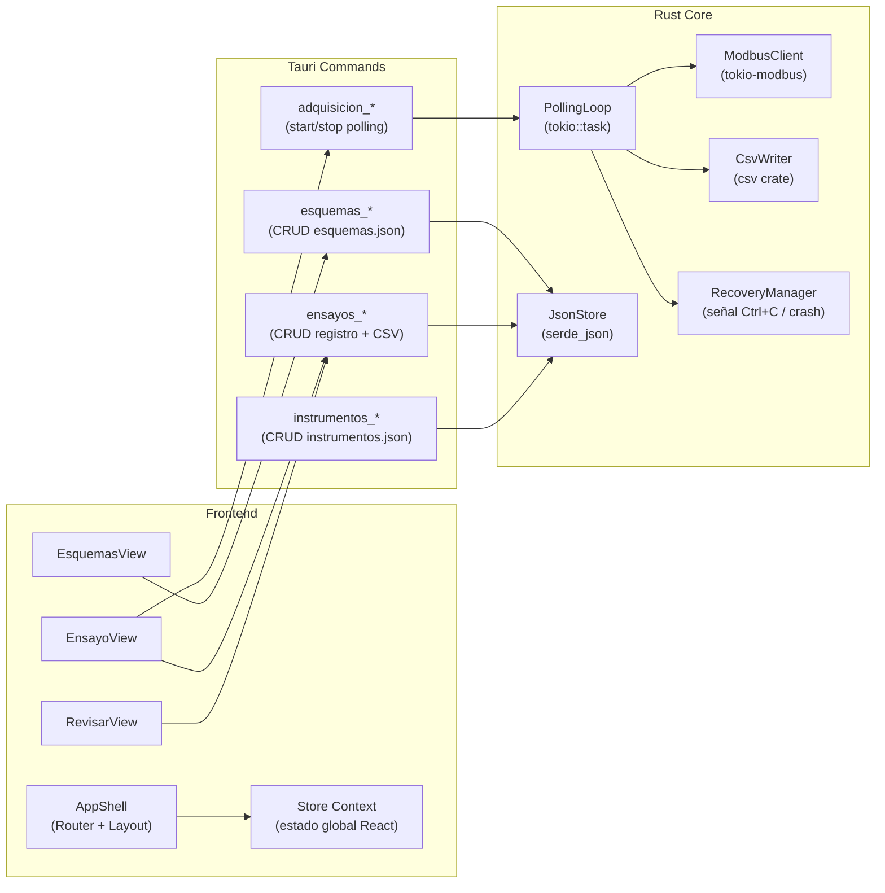
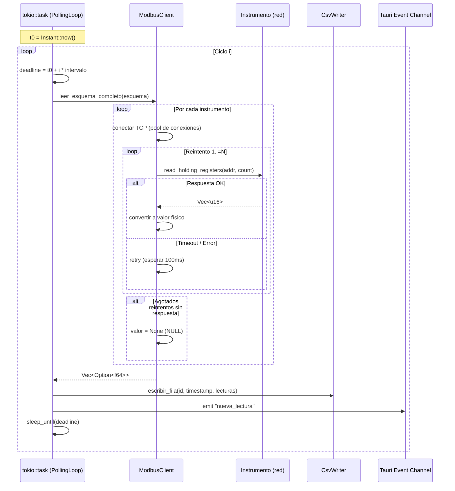
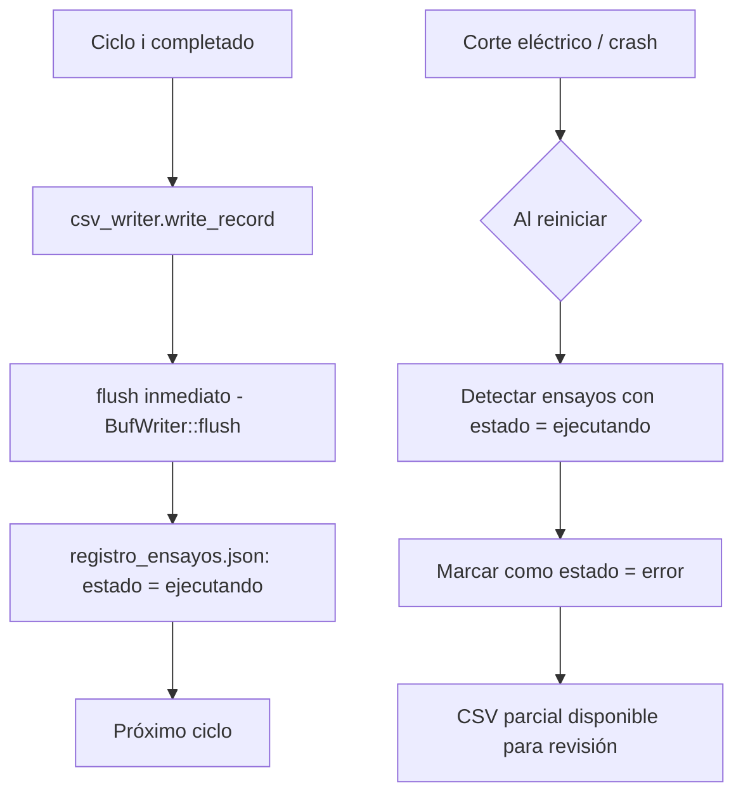

# Documento de Diseño: DAQ Software

## Descripción General

Software de escritorio para adquisición y visualización de datos de instrumentos de medición industriales, construido con React + Tauri. Permite definir esquemas de adquisición con instrumentos ADAM 4118 (temperatura) y Janitza UMG509-PRO (variables eléctricas), ejecutar ensayos con registro temporal equiespaciado vía Modbus TCP/IP, y visualizar datos en tiempo real con gráficos históricos. Los datos se persisten localmente en archivos JSON y CSV. El ejecutable se instala en Windows 10/11 como un `.exe` sin dependencias externas, compilado desde Ubuntu.

El MVP soporta múltiples instrumentos por esquema, adquisición configurable de 10s a 600s, manejo de errores Modbus con reintentos, recuperación ante corte eléctrico, visualización en tiempo real, estadísticas básicas, y exportación a CSV.

---

## 1. Arquitectura de Alto Nivel

### 1.1 Capas del sistema



### 1.2 Flujo de datos principal



### 1.3 Diagrama de módulos y responsabilidades



---

## 2. Modelos de Datos

### 2.1 JSON Schema: `instrumentos.json`

El archivo es un array de objetos `Instrumento`. Cada instrumento es independiente y puede pertenecer a múltiples esquemas.

```typescript
interface Instrumento {
  id: number; // ID autoincremental
  tipo: "ADAM4118" | "JANITZA_UMG509";
  nombre: string; // Nombre descriptivo, ej: "ADAM_TEMP_01"
  direccion_ip: string; // IPv4, ej: "192.168.1.10"
  puerto: number; // Puerto Modbus TCP, default 502
  slave_id: number; // Modbus Unit ID (1-247)
  timeout_ms: number; // Timeout por lectura, ej: 1000
  reintentos: number; // Reintentos antes de registrar NULL, ej: 3
}
```

**Ejemplo en disco:**

```json
[
  {
    "id": 1,
    "tipo": "ADAM4118",
    "nombre": "ADAM_TEMP_01",
    "direccion_ip": "192.168.1.10",
    "puerto": 502,
    "slave_id": 1,
    "timeout_ms": 1000,
    "reintentos": 3
  },
  {
    "id": 2,
    "tipo": "JANITZA_UMG509",
    "nombre": "JANITZA_ELEC_01",
    "direccion_ip": "192.168.1.20",
    "puerto": 502,
    "slave_id": 1,
    "timeout_ms": 2000,
    "reintentos": 3
  }
]
```

### 2.2 JSON Schema: `esquemas.json`

```typescript
type CanalADAM = 1 | 2 | 3 | 4 | 5 | 6 | 7 | 8;
type VariableJanitza =
  | "v1"
  | "v2"
  | "v3"
  | "c1"
  | "c2"
  | "c3"
  | "p1"
  | "p2"
  | "p3"
  | "f"
  | "e1"
  | "e2"
  | "e3"
  | "fp1"
  | "fp2"
  | "fp3"
  | "thd1"
  | "thd2"
  | "thd3";

interface CanalesADAM {
  [key: `canales_${number}`]: CanalADAM[]; // ej: canales_1, canales_2
}

interface CanalesJanitza {
  [key: `canales_${number}`]: VariableJanitza[];
}

interface Esquema {
  id: number;
  nombre: string;
  version: number; // Semver numérico, ej: 1.0
  vigente: boolean; // false = eliminado lógicamente
  fecha_hora_crea: string; // "DDMMYYYY_HHmmss"
  usuario_crea: string;
  descripcion: string;
  cant_adam: number; // Cantidad de ADAM en este esquema
  instrumentos_adam: number[]; // IDs de instrumentos.json (ADAM)
  canales_adam: CanalesADAM; // Mapa índice → canales seleccionados
  cant_janitzas: number;
  instrumentos_janitza: number[]; // IDs de instrumentos.json (Janitza)
  canales_janitzas: CanalesJanitza;
}
```

**Ejemplo en disco:**

```json
[
  {
    "id": 1,
    "nombre": "esquema_motor_A",
    "version": 1.0,
    "vigente": true,
    "fecha_hora_crea": "23062026_124400",
    "usuario_crea": "",
    "descripcion": "Motor principal sala de pruebas",
    "cant_adam": 1,
    "instrumentos_adam": [1],
    "canales_adam": {
      "canales_1": [1, 2, 3, 4]
    },
    "cant_janitzas": 1,
    "instrumentos_janitza": [2],
    "canales_janitzas": {
      "canales_1": ["v1", "v2", "v3", "c1", "c2", "c3", "p1", "p2", "p3", "f"]
    }
  }
]
```

### 2.3 JSON Schema: `registro_ensayos.json`

```typescript
type EstadoEnsayo = "creado" | "ejecutando" | "finalizado" | "error";

interface RegistroEnsayo {
  id: number;
  nombre: string; // Nombre del ensayo ingresado por usuario
  descripcion: string;
  fecha_hora_inicio: string; // "DDMMYYYY_HHmmss"
  fecha_hora_fin: string | null; // null mientras ejecutando
  esquema_id: number; // FK a esquemas.json
  intervalo_segundos: number; // 10 a 600
  estado: EstadoEnsayo;
  archivo_csv: string; // Nombre del archivo CSV, ej: "ENS_20260623_103000_MotorA.csv"
  aliases: AliasMap; // Mapa de aliases definidos al crear el ensayo
}

interface AliasMap {
  [columna: string]: string; // ej: "ADAM1_1" → "temp_motor"
}
```

**Ejemplo en disco:**

```json
[
  {
    "id": 1,
    "nombre": "ensayo_motor_prueba",
    "descripcion": "Primera prueba motor sala A",
    "fecha_hora_inicio": "23062026_124400",
    "fecha_hora_fin": "23062026_134400",
    "esquema_id": 1,
    "intervalo_segundos": 30,
    "estado": "finalizado",
    "archivo_csv": "ENS_20260623_124400_ensayo_motor_prueba.csv",
    "aliases": {
      "ADAM1_1": "temp_motor",
      "ADAM1_2": "temp_devanado",
      "JTZA1_V1": "voltaje_fase1"
    }
  }
]
```

### 2.4 Estructura CSV de ensayo

La primera fila es siempre el encabezado. Las columnas se generan dinámicamente desde el esquema al momento de crear el ensayo.

**Formato nombre de archivo:** `ENS_YYYYMMDD_HHmmss_<nombre>.csv`

**Formato columnas:**

- `id` — entero autoincremental por fila
- `fecha_hora` — timestamp ISO 8601: `2026-06-23T12:44:00`
- Para ADAM: `ADAM{N}_{canal}_{alias}` → ej: `ADAM1_1_temp_motor`
- Para Janitza: `JTZA{N}_{variable}_{alias}` → ej: `JTZA1_V1_voltaje_fase1`
- Valores NULL se escriben como cadena vacía `""`

**Ejemplo CSV:**

```csv
id,fecha_hora,ADAM1_1_temp_motor,ADAM1_2_temp_devanado,JTZA1_V1_voltaje_fase1,JTZA1_C1_corriente_fase1
1,2026-06-23T12:44:00,125.3,98.7,220.1,15.4
2,2026-06-23T12:44:30,126.1,99.2,220.3,15.6
3,2026-06-23T12:45:00,,99.5,220.0,15.3
```

La fila 3 muestra NULL en `ADAM1_1` (campo vacío): el instrumento no respondió a tiempo.

---

## 3. Comunicación Modbus

### 3.1 Mapas de registros

**ADAM 4118 — Temperatura**

| Canal | Registro Modbus | Tipo   | Conversión                           |
| ----- | --------------- | ------ | ------------------------------------ |
| 1     | 0               | uint16 | `(val / 65535.0) * 500.0 - 100.0` °C |
| 2     | 1               | uint16 | ídem                                 |
| 3     | 2               | uint16 | ídem                                 |
| 4     | 3               | uint16 | ídem                                 |
| 5     | 4               | uint16 | ídem                                 |
| 6     | 5               | uint16 | ídem                                 |
| 7     | 6               | uint16 | ídem                                 |
| 8     | 7               | uint16 | ídem                                 |

La conversión escala el valor crudo (0–65535) al rango de temperatura (-100°C a +400°C):
`temperatura = (raw / 65535.0) * 500.0 - 100.0`

**Janitza UMG509-PRO — Variables eléctricas**

Cada variable ocupa 2 registros contiguos que forman un float IEEE 754 big-endian (32 bits).

| Variable          | Reg. inicio | Unidad |
| ----------------- | ----------- | ------ |
| VOLTAJE_1         | 19000       | V      |
| VOLTAJE_2         | 19002       | V      |
| VOLTAJE_3         | 19004       | V      |
| CORRIENTE_1       | 19012       | A      |
| CORRIENTE_2       | 19014       | A      |
| CORRIENTE_3       | 19016       | A      |
| POTENCIA_1        | 19020       | W      |
| POTENCIA_2        | 19022       | W      |
| POTENCIA_3        | 19024       | W      |
| FRECUENCIA        | 19050       | Hz     |
| ENERGIA_1         | 19054       | Wh     |
| ENERGIA_2         | 19056       | Wh     |
| ENERGIA_3         | 19058       | Wh     |
| FACTOR_POTENCIA_1 | 19044       | —      |
| FACTOR_POTENCIA_2 | 19046       | —      |
| FACTOR_POTENCIA_3 | 19048       | —      |
| THD_1             | 19110       | —      |
| THD_2             | 19112       | —      |
| THD_3             | 19114       | —      |

Conversión IEEE 754 big-endian: los dos registros uint16 se concatenan `[high, low]` y se interpretan como f32.

### 3.2 Arquitectura del Polling Loop



### 3.3 Temporización equiespaciada

El loop usa un tiempo de inicio absoluto `t0` y calcula cada deadline como `t0 + i * intervalo`. Esto evita la acumulación de desfase causada por el tiempo de ejecución de cada ciclo.

```rust
// Pseudocódigo Rust
async fn polling_loop(config: PollingConfig, tx: EventSender) {
    let t0 = Instant::now();
    let mut fila_id: u64 = 1;

    for ciclo in 0u64.. {
        let deadline = t0 + Duration::from_secs(ciclo * config.intervalo_seg);

        // Leer todos los instrumentos en paralelo
        let lecturas = leer_esquema_completo(&config.esquema).await;
        let timestamp = Utc::now();

        // Escribir a CSV con flush inmediato (recuperación ante corte)
        csv_writer.escribir_fila(fila_id, timestamp, &lecturas).await?;

        // Notificar UI
        tx.emit("nueva_lectura", &lecturas);
        fila_id += 1;

        // Dormir hasta el próximo deadline exacto
        tokio::time::sleep_until(deadline.into()).await;
    }
}
```

**Manejo de NULL**: si el instrumento no responde antes del deadline del siguiente ciclo, la fila registra campo vacío. El reintento no puede extenderse más allá del intervalo configurado menos un margen de seguridad (10% del intervalo).

### 3.4 Lectura ADAM 4118 (Rust)

```rust
async fn leer_adam(
    client: &mut ModbusTcpClient,
    canales: &[u8],          // ej: [1, 2, 5] → registros 0, 1, 4
    reintentos: u8,
    timeout: Duration,
) -> Vec<Option<f64>> {
    let mut resultados = vec![None; canales.len()];

    for (idx, &canal) in canales.iter().enumerate() {
        let registro = (canal - 1) as u16;   // Canal 1 → registro 0
        let mut valor: Option<f64> = None;

        for _intento in 0..=reintentos {
            match tokio::time::timeout(
                timeout,
                client.read_holding_registers(registro, 1)
            ).await {
                Ok(Ok(regs)) => {
                    let raw = regs[0] as f64;
                    valor = Some((raw / 65535.0) * 500.0 - 100.0);
                    break;
                }
                _ => tokio::time::sleep(Duration::from_millis(100)).await,
            }
        }
        resultados[idx] = valor;
    }
    resultados
}
```

### 3.5 Lectura Janitza UMG509-PRO (Rust)

```rust
async fn leer_janitza(
    client: &mut ModbusTcpClient,
    variables: &[JanitzaVar],
    reintentos: u8,
    timeout: Duration,
) -> Vec<Option<f64>> {
    let mut resultados = Vec::with_capacity(variables.len());

    for variable in variables {
        let addr = variable.registro_inicio();  // ej: VOLTAJE_1 → 19000
        let mut valor: Option<f64> = None;

        for _intento in 0..=reintentos {
            match tokio::time::timeout(
                timeout,
                client.read_holding_registers(addr, 2)   // Leer 2 registros
            ).await {
                Ok(Ok(regs)) if regs.len() == 2 => {
                    // IEEE 754 big-endian: high word primero
                    let bytes = [
                        (regs[0] >> 8) as u8, (regs[0] & 0xFF) as u8,
                        (regs[1] >> 8) as u8, (regs[1] & 0xFF) as u8,
                    ];
                    valor = Some(f32::from_be_bytes(bytes) as f64);
                    break;
                }
                _ => tokio::time::sleep(Duration::from_millis(100)).await,
            }
        }
        resultados.push(valor);
    }
    resultados
}
```

---

## 4. Estructura de Carpetas del Proyecto

```
daq_ingcer/
├── src-tauri/                        # Backend Rust (Tauri)
│   ├── Cargo.toml
│   ├── build.rs
│   ├── tauri.conf.json
│   └── src/
│       ├── main.rs                   # Entrada Tauri, registro de commands
│       ├── commands/
│       │   ├── esquemas.rs           # CRUD esquemas
│       │   ├── ensayos.rs            # CRUD registro ensayos
│       │   ├── adquisicion.rs        # start/stop polling, estado
│       │   └── instrumentos.rs       # CRUD instrumentos
│       ├── modbus/
│       │   ├── mod.rs
│       │   ├── client.rs             # Abstracción ModbusTcpClient
│       │   ├── adam.rs               # Lectura y conversión ADAM 4118
│       │   └── janitza.rs            # Lectura y conversión Janitza
│       ├── polling/
│       │   ├── mod.rs
│       │   ├── loop.rs               # PollingLoop (tokio::task)
│       │   └── scheduler.rs          # Temporización equiespaciada
│       ├── persistence/
│       │   ├── mod.rs
│       │   ├── json_store.rs         # Lectura/escritura JSON con serde
│       │   ├── csv_writer.rs         # Escritura CSV con flush inmediato
│       │   └── recovery.rs           # Manejo corte eléctrico / crash
│       └── types/
│           ├── mod.rs
│           ├── esquema.rs            # Structs Esquema, Canal*, etc.
│           ├── ensayo.rs             # Structs Ensayo, AliasMap
│           ├── instrumento.rs        # Struct Instrumento
│           └── lectura.rs            # Struct LecturaInstante
│
├── src/                              # Frontend React + TypeScript
│   ├── main.tsx                      # Entrada React
│   ├── App.tsx                       # Router principal
│   ├── store/
│   │   ├── useEsquemasStore.ts       # Zustand: estado esquemas
│   │   ├── useEnsayoStore.ts         # Zustand: estado ensayo activo
│   │   └── useUiStore.ts             # Zustand: estado UI (tab, modal, etc.)
│   ├── views/
│   │   ├── EsquemasView.tsx          # Lista y CRUD de esquemas
│   │   ├── EnsayoView.tsx            # Vista de ensayo en curso
│   │   └── RevisarEnsayoView.tsx     # Vista de ensayo histórico
│   ├── components/
│   │   ├── esquemas/
│   │   │   ├── EsquemaCard.tsx
│   │   │   ├── CrearEsquemaModal.tsx
│   │   │   └── SelectorInstrumentos.tsx
│   │   ├── ensayo/
│   │   │   ├── CrearEnsayoModal.tsx
│   │   │   ├── AliasEditor.tsx
│   │   │   ├── PanelInstantaneo.tsx  # Valores en tiempo real
│   │   │   ├── PanelEstadisticas.tsx # Promedio, mediana, etc.
│   │   │   └── ControlEnsayo.tsx     # Botones iniciar/pausar/detener
│   │   ├── graficos/
│   │   │   ├── GraficoTemperatura.tsx
│   │   │   ├── GraficoElectrico.tsx
│   │   │   └── CotasControl.tsx      # Panel para configurar cotas
│   │   └── shared/
│   │       ├── StatusBadge.tsx
│   │       ├── IntervaloPicker.tsx
│   │       └── ConfirmModal.tsx
│   ├── hooks/
│   │   ├── useNuevaLectura.ts        # Suscripción al evento Tauri
│   │   ├── useEstadisticas.ts        # Cálculo promedio, mediana, etc.
│   │   └── useCargaEnsayo.ts         # Cargar CSV histórico
│   ├── lib/
│   │   ├── tauriCommands.ts          # Wrappers tipados sobre invoke()
│   │   ├── csvParser.ts              # Parser CSV para revisión histórica
│   │   └── estadisticas.ts           # Funciones estadísticas puras
│   └── types/
│       ├── esquema.ts
│       ├── ensayo.ts
│       ├── instrumento.ts
│       └── lectura.ts
│
├── datos/                            # Directorio de datos en runtime
│   ├── instrumentos.json
│   ├── esquemas.json
│   ├── registro_ensayos.json
│   └── ensayos/
│       └── ENS_*.csv
│
├── package.json
├── tsconfig.json
├── tailwind.config.ts
├── vite.config.ts
└── index.html
```

El directorio `datos/` se crea en la primera ejecución. En la build de producción para Windows, Tauri resuelve la ruta usando `app_data_dir()` o `resolve_resource()` para garantizar un path escribible sin privilegios de administrador.

---

## 5. Diseño de Bajo Nivel

### 5.1 Tauri Commands: firmas principales

```rust
// === commands/esquemas.rs ===

#[tauri::command]
async fn listar_esquemas(state: State<'_, AppState>) -> Result<Vec<Esquema>, String>;

#[tauri::command]
async fn crear_esquema(
    state: State<'_, AppState>,
    payload: CrearEsquemaPayload,
) -> Result<Esquema, String>;

#[tauri::command]
async fn actualizar_esquema(
    state: State<'_, AppState>,
    id: u32,
    payload: ActualizarEsquemaPayload,
) -> Result<Esquema, String>;

#[tauri::command]
async fn deshabilitar_esquema(
    state: State<'_, AppState>,
    id: u32,
) -> Result<(), String>;
// Precondición: esquema.id existe y vigente == true
// Postcondición: esquema.vigente == false en esquemas.json

// === commands/instrumentos.rs ===

#[tauri::command]
async fn listar_instrumentos(state: State<'_, AppState>) -> Result<Vec<Instrumento>, String>;

#[tauri::command]
async fn crear_instrumento(
    state: State<'_, AppState>,
    payload: CrearInstrumentoPayload,
) -> Result<Instrumento, String>;

#[tauri::command]
async fn probar_conexion(
    ip: String,
    puerto: u16,
    slave_id: u8,
    timeout_ms: u64,
) -> Result<bool, String>;
// Intenta conectar vía Modbus TCP, retorna true si hay respuesta

// === commands/ensayos.rs ===

#[tauri::command]
async fn listar_ensayos(state: State<'_, AppState>) -> Result<Vec<RegistroEnsayo>, String>;

#[tauri::command]
async fn crear_ensayo(
    state: State<'_, AppState>,
    payload: CrearEnsayoPayload,
) -> Result<RegistroEnsayo, String>;
// Precondición: esquema_id existe y está vigente
// Postcondición: CSV creado con cabeceras, estado = "creado"

#[tauri::command]
async fn finalizar_ensayo(
    state: State<'_, AppState>,
    id: u32,
) -> Result<RegistroEnsayo, String>;
// Precondición: ensayo.estado == "ejecutando"
// Postcondición: estado = "finalizado", fecha_hora_fin registrada

#[tauri::command]
async fn cargar_datos_ensayo(
    state: State<'_, AppState>,
    id: u32,
) -> Result<DatosEnsayo, String>;
// Lee y parsea el CSV del ensayo para revisión histórica

#[tauri::command]
async fn exportar_csv(
    state: State<'_, AppState>,
    id: u32,
    destino: String,
) -> Result<(), String>;
// Copia el archivo CSV al path destino elegido por el usuario

// === commands/adquisicion.rs ===

#[tauri::command]
async fn iniciar_adquisicion(
    app: AppHandle,
    state: State<'_, AppState>,
    ensayo_id: u32,
) -> Result<(), String>;
// Precondición: ensayo.estado == "creado"
// Postcondición: PollingLoop activo, estado = "ejecutando"

#[tauri::command]
async fn detener_adquisicion(
    state: State<'_, AppState>,
    ensayo_id: u32,
) -> Result<(), String>;
// Envía señal de parada al PollingLoop, espera terminación limpia
```

### 5.2 Tipos principales (Rust)

```rust
// types/lectura.rs

#[derive(Debug, Clone, Serialize, Deserialize)]
pub struct LecturaInstante {
    pub id: u64,
    pub timestamp: DateTime<Utc>,
    pub valores: Vec<ValorCanal>,
}

#[derive(Debug, Clone, Serialize, Deserialize)]
pub struct ValorCanal {
    pub columna: String,          // ej: "ADAM1_1_temp_motor"
    pub valor: Option<f64>,       // None = NULL
    pub unidad: String,           // "°C", "V", "A", "W", etc.
}

// types/esquema.rs

#[derive(Debug, Clone, Serialize, Deserialize)]
pub struct Esquema {
    pub id: u32,
    pub nombre: String,
    pub version: f32,
    pub vigente: bool,
    pub fecha_hora_crea: String,
    pub usuario_crea: String,
    pub descripcion: String,
    pub cant_adam: usize,
    pub instrumentos_adam: Vec<u32>,
    pub canales_adam: HashMap<String, Vec<u8>>,
    pub cant_janitzas: usize,
    pub instrumentos_janitza: Vec<u32>,
    pub canales_janitzas: HashMap<String, Vec<String>>,
}

// types/ensayo.rs

#[derive(Debug, Clone, Serialize, Deserialize)]
pub struct RegistroEnsayo {
    pub id: u32,
    pub nombre: String,
    pub descripcion: String,
    pub fecha_hora_inicio: String,
    pub fecha_hora_fin: Option<String>,
    pub esquema_id: u32,
    pub intervalo_segundos: u32,
    pub estado: EstadoEnsayo,
    pub archivo_csv: String,
    pub aliases: HashMap<String, String>,
}

#[derive(Debug, Clone, Serialize, Deserialize)]
#[serde(rename_all = "lowercase")]
pub enum EstadoEnsayo {
    Creado,
    Ejecutando,
    Finalizado,
    Error,
}
```

### 5.3 Tipos principales (TypeScript / Frontend)

```typescript
// types/lectura.ts
export interface LecturaInstante {
  id: number;
  timestamp: string; // ISO 8601
  valores: ValorCanal[];
}

export interface ValorCanal {
  columna: string; // "ADAM1_1_temp_motor"
  valor: number | null;
  unidad: string;
}

// types/ensayo.ts
export type EstadoEnsayo = "creado" | "ejecutando" | "finalizado" | "error";

export interface RegistroEnsayo {
  id: number;
  nombre: string;
  descripcion: string;
  fecha_hora_inicio: string;
  fecha_hora_fin: string | null;
  esquema_id: number;
  intervalo_segundos: number;
  estado: EstadoEnsayo;
  archivo_csv: string;
  aliases: Record<string, string>;
}

// lib/tauriCommands.ts — wrappers tipados
import { invoke } from "@tauri-apps/api/core";
import type {
  Esquema,
  RegistroEnsayo,
  Instrumento,
  LecturaInstante,
} from "../types";

export const tauriCmd = {
  listarEsquemas: () => invoke<Esquema[]>("listar_esquemas"),
  crearEsquema: (payload: CrearEsquemaPayload) =>
    invoke<Esquema>("crear_esquema", { payload }),
  deshabilitarEsquema: (id: number) =>
    invoke<void>("deshabilitar_esquema", { id }),
  crearEnsayo: (payload: CrearEnsayoPayload) =>
    invoke<RegistroEnsayo>("crear_ensayo", { payload }),
  iniciarAdquisicion: (ensayoId: number) =>
    invoke<void>("iniciar_adquisicion", { ensayoId }),
  detenerAdquisicion: (ensayoId: number) =>
    invoke<void>("detener_adquisicion", { ensayoId }),
  finalizarEnsayo: (id: number) =>
    invoke<RegistroEnsayo>("finalizar_ensayo", { id }),
  exportarCsv: (id: number, destino: string) =>
    invoke<void>("exportar_csv", { id, destino }),
  cargarDatosEnsayo: (id: number) =>
    invoke<DatosEnsayo>("cargar_datos_ensayo", { id }),
  probarConexion: (
    ip: string,
    puerto: number,
    slaveId: number,
    timeoutMs: number,
  ) => invoke<boolean>("probar_conexion", { ip, puerto, slaveId, timeoutMs }),
};
```

### 5.4 Algoritmo de generación de cabeceras CSV

```rust
// persistence/csv_writer.rs

pub fn generar_cabeceras(esquema: &Esquema, aliases: &HashMap<String, String>) -> Vec<String> {
    // Precondición: esquema.canales_adam y canales_janitzas son consistentes
    // con cant_adam y cant_janitzas
    let mut cols = vec!["id".to_string(), "fecha_hora".to_string()];

    // Columnas ADAM: ADAM{n}_{canal}_{alias}
    for n in 1..=esquema.cant_adam {
        let key = format!("canales_{}", n);
        if let Some(canales) = esquema.canales_adam.get(&key) {
            for &canal in canales {
                let base = format!("ADAM{}_{}", n, canal);
                let alias = aliases.get(&base).cloned().unwrap_or_default();
                cols.push(format!("{}{}", base, if alias.is_empty() { String::new() } else { format!("_{}", alias) }));
            }
        }
    }

    // Columnas Janitza: JTZA{n}_{variable}_{alias}
    for n in 1..=esquema.cant_janitzas {
        let key = format!("canales_{}", n);
        if let Some(variables) = esquema.canales_janitzas.get(&key) {
            for var in variables {
                let base = format!("JTZA{}_{}", n, var.to_uppercase());
                let alias = aliases.get(&base).cloned().unwrap_or_default();
                cols.push(format!("{}{}", base, if alias.is_empty() { String::new() } else { format!("_{}", alias) }));
            }
        }
    }

    // Postcondición: cols.len() >= 2, orden determinístico
    cols
}
```

### 5.5 Cálculo estadístico (TypeScript)

```typescript
// lib/estadisticas.ts

export interface Estadisticas {
  promedio: number | null;
  mediana: number | null;
  moda: number | null;
  desviacion_std: number | null;
  minimo: number | null;
  maximo: number | null;
}

export function calcularEstadisticas(valores: (number | null)[]): Estadisticas {
  // Precondición: valores puede contener null (se excluyen del cálculo)
  const nums = valores.filter((v): v is number => v !== null);

  if (nums.length === 0) {
    return {
      promedio: null,
      mediana: null,
      moda: null,
      desviacion_std: null,
      minimo: null,
      maximo: null,
    };
  }

  const sorted = [...nums].sort((a, b) => a - b);
  const n = nums.length;

  // Promedio
  const promedio = nums.reduce((s, v) => s + v, 0) / n;

  // Mediana
  const mediana =
    n % 2 === 0
      ? (sorted[n / 2 - 1] + sorted[n / 2]) / 2
      : sorted[Math.floor(n / 2)];

  // Moda (valor más frecuente)
  const freq = new Map<number, number>();
  nums.forEach((v) => freq.set(v, (freq.get(v) ?? 0) + 1));
  const maxFreq = Math.max(...freq.values());
  const moda = [...freq.entries()].find(([, f]) => f === maxFreq)?.[0] ?? null;

  // Desviación estándar (poblacional)
  const desviacion_std = Math.sqrt(
    nums.reduce((s, v) => s + (v - promedio) ** 2, 0) / n,
  );

  // Postcondición: todos los campos calculados son números finitos
  return {
    promedio,
    mediana,
    moda,
    desviacion_std,
    minimo: sorted[0],
    maximo: sorted[n - 1],
  };
}
```

### 5.6 Hook de suscripción a lecturas en tiempo real

```typescript
// hooks/useNuevaLectura.ts

import { useEffect, useRef } from "react";
import { listen, type UnlistenFn } from "@tauri-apps/api/event";
import type { LecturaInstante } from "../types";

export function useNuevaLectura(
  onLectura: (lectura: LecturaInstante) => void,
): void {
  const callbackRef = useRef(onLectura);
  callbackRef.current = onLectura;

  useEffect(() => {
    let unlisten: UnlistenFn | null = null;

    listen<LecturaInstante>("nueva_lectura", (event) => {
      callbackRef.current(event.payload);
    }).then((fn) => {
      unlisten = fn;
    });

    return () => {
      unlisten?.();
    };
  }, []); // Solo una vez al montar
}
```

---

## 6. Estrategia de Persistencia y Recuperación

### 6.1 Escritura incremental y resistencia a cortes

La estrategia central es **escribir en disco en cada ciclo con flush inmediato**, nunca acumular en memoria. De esta forma, un corte eléctrico solo pierde el ciclo en curso, no todo el ensayo.



**Flujo de escritura CSV:**

```rust
// persistence/csv_writer.rs

pub struct CsvWriter {
    writer: csv::Writer<BufWriter<File>>,
    ruta: PathBuf,
}

impl CsvWriter {
    pub fn nueva(ruta: &Path, cabeceras: &[String]) -> Result<Self, io::Error> {
        let file = OpenOptions::new()
            .create(true)
            .append(true)
            .open(ruta)?;
        let buf = BufWriter::new(file);
        let mut writer = csv::Writer::from_writer(buf);
        // Escribir cabeceras solo si el archivo está vacío
        if ruta.metadata()?.len() == 0 {
            writer.write_record(cabeceras)?;
            writer.flush()?;
        }
        Ok(Self { writer, ruta: ruta.to_path_buf() })
    }

    pub fn escribir_fila(&mut self, lectura: &LecturaInstante) -> Result<(), io::Error> {
        let mut fila: Vec<String> = vec![
            lectura.id.to_string(),
            lectura.timestamp.to_rfc3339(),
        ];
        for canal in &lectura.valores {
            fila.push(match canal.valor {
                Some(v) => format!("{:.4}", v),
                None => String::new(),   // NULL = campo vacío en CSV
            });
        }
        self.writer.write_record(&fila)?;
        self.writer.flush()?;   // Flush inmediato — clave para recuperación
        Ok(())
    }
}
```

### 6.2 Recovery Manager

```rust
// persistence/recovery.rs

pub async fn verificar_ensayos_colgados(json_store: &JsonStore) -> Result<(), String> {
    // Al iniciar la app, detecta ensayos que quedaron en "ejecutando"
    // (indica crash o corte eléctrico)
    let mut registro = json_store.leer_registro_ensayos().await?;

    for ensayo in registro.iter_mut() {
        if matches!(ensayo.estado, EstadoEnsayo::Ejecutando) {
            ensayo.estado = EstadoEnsayo::Error;
            ensayo.fecha_hora_fin = Some(chrono::Utc::now()
                .format("%d%m%Y_%H%M%S").to_string());
        }
    }

    json_store.escribir_registro_ensayos(&registro).await?;
    Ok(())
}
```

Al iniciarse la app, `main.rs` llama `verificar_ensayos_colgados()` antes de registrar los commands. Los ensayos en estado `error` muestran en la UI un badge diferenciado y el CSV parcial puede abrirse para revisión.

### 6.3 JSON Store — operaciones atómicas

Para evitar corrupción de archivos JSON ante escrituras parciales, se usa el patrón write-to-temp + rename:

```rust
// persistence/json_store.rs

pub async fn escribir_atomico<T: Serialize>(
    ruta: &Path,
    datos: &T,
) -> Result<(), String> {
    // Precondición: datos serializable como JSON válido
    let temp_ruta = ruta.with_extension("tmp");
    let json = serde_json::to_string_pretty(datos)
        .map_err(|e| e.to_string())?;

    tokio::fs::write(&temp_ruta, &json)
        .await
        .map_err(|e| e.to_string())?;

    // rename es atómico en Linux y Windows (mismo filesystem)
    tokio::fs::rename(&temp_ruta, ruta)
        .await
        .map_err(|e| e.to_string())?;

    // Postcondición: ruta contiene el nuevo JSON, temp_ruta no existe
    Ok(())
}
```

---

## 7. Diseño de la Interfaz de Usuario

### 7.1 Navegación principal

La app tiene una navegación lateral fija con tres secciones principales:

```
┌──────────────────────────────────────────────────────┐
│  DAQ Software                           [●] Conectado │
├────────────┬─────────────────────────────────────────┤
│            │                                          │
│ [≡] Esquemas │          ÁREA DE CONTENIDO            │
│ [▶] Ensayos │                                          │
│ [⏱] En curso │                                         │
│ [⚙] Config  │                                          │
│            │                                          │
└────────────┴─────────────────────────────────────────┘
```

### 7.2 Vista: Esquemas

```
┌─────────────────────────────────────────────────────┐
│  Esquemas de Adquisición          [+ Nuevo Esquema] │
├─────────────────────────────────────────────────────┤
│  ┌──────────────────┐  ┌──────────────────┐         │
│  │ esquema_motor_A  │  │ esquema_bomba_02  │         │
│  │ 1 ADAM · 1 JTZA  │  │ 2 ADAM · 2 JTZA  │         │
│  │ v1.0 · Vigente   │  │ v1.0 · Vigente   │         │
│  │ [Crear Ensayo]   │  │ [Crear Ensayo]   │         │
│  │ [Editar][Borrar] │  │ [Editar][Borrar] │         │
│  └──────────────────┘  └──────────────────┘         │
└─────────────────────────────────────────────────────┘
```

**Modal: Crear/Editar Esquema** — flujo en pasos:

1. Datos básicos (nombre, descripción)
2. Agregar instrumentos (selector con IP, tipo, slave ID) — botón "Probar conexión"
3. Selección de canales por instrumento (MVP: todos seleccionados por defecto)
4. Confirmar y guardar

### 7.3 Vista: Crear Ensayo (Modal)

```
┌────────────────── Nuevo Ensayo ──────────────────┐
│  Esquema: esquema_motor_A                         │
│                                                   │
│  Nombre del ensayo: [____________________]        │
│  Descripción:       [____________________]        │
│                                                   │
│  Intervalo de adquisición:                        │
│    [10s] [30s ✓] [60s] [120s] [300s] [600s]       │
│    ○ Personalizado: [___] segundos                │
│                                                   │
│  Aliases de campos:                               │
│  ┌─────────────────┬──────────────────────────┐  │
│  │ ADAM1_1         │ [temp_motor           ]   │  │
│  │ ADAM1_2         │ [temp_devanado        ]   │  │
│  │ JTZA1_V1        │ [voltaje_fase1        ]   │  │
│  └─────────────────┴──────────────────────────┘  │
│                                                   │
│             [Cancelar]  [Iniciar Ensayo]          │
└───────────────────────────────────────────────────┘
```

### 7.4 Vista: Ensayo en Curso

```
┌─────────────────────────────────────────────────────┐
│  ensayo_motor_prueba  [● EJECUTANDO]  ⏱ 00:14:30    │
│                              [⏸ Pausar] [⏹ Detener] │
├──────────────────┬──────────────────────────────────┤
│  TEMPERATURA (°C)│  VALORES INSTANTÁNEOS            │
│  ┌─────────────┐ │  temp_motor:     126.1 °C         │
│  │   /\/\/\/\  │ │  temp_devanado:   99.2 °C         │
│  │  /        \ │ │  voltaje_fase1:  220.3 V          │
│  │/            │ │  corriente_f1:   15.6 A           │
│  └──────────── │ │  potencia_f1:   3.4 kW            │
│  [Cotas ▼]    │ │                                   │
├──────────────────┤  ESTADÍSTICAS (desde inicio)     │
│  ELÉCTRICO      │  ┌────────┬───────┬───────────┐  │
│  ┌─────────────┐ │  │       │temp_m.│voltaje_f1 │  │
│  │  ─ ─ ─ ─ ─ │ │  │Prom   │ 125.8 │   220.1   │  │
│  └─────────────┘ │  │Mediana│ 125.9 │   220.0   │  │
│  [V] [A] [W] [f] │  │StdDev │   0.8 │     0.2   │  │
└──────────────────┴──└────────┴───────┴───────────┘  │
```

### 7.5 Vista: Revisar Ensayo Histórico

```
┌─────────────────────────────────────────────────────┐
│  Ensayos Realizados                  [📁 Cargar CSV] │
├─────────────────────────────────────────────────────┤
│  ID │ Nombre               │ Inicio        │ Estado  │
│  1  │ ensayo_motor_prueba  │ 23/06 12:44   │ ✅ OK   │
│  2  │ ensayo_bomba_test    │ 24/06 09:00   │ ⚠ Error │
├─────────────────────────────────────────────────────┤
│  [Ver detalles ▼]  ensayo_motor_prueba               │
│                                                      │
│  [Gráfico Temperatura] [Gráfico Eléctrico]          │
│  [Tabla de datos] [Estadísticas]                    │
│                                                      │
│                              [⬇ Descargar CSV]      │
└─────────────────────────────────────────────────────┘
```

### 7.6 Componente: GráficoTemperatura

```typescript
// components/graficos/GraficoTemperatura.tsx

interface GraficoTemperaturaProps {
  datos: LecturaInstante[]; // Buffer de lecturas (ventana deslizante)
  columnasTemp: string[]; // ej: ["ADAM1_1_temp_motor", "ADAM1_2_..."]
  cotas?: CotasConfig; // Líneas horizontales de referencia
  escalaAuto?: boolean; // Ajustar eje Y automáticamente
  rangoY?: [number, number]; // Rango manual del eje Y
}

interface CotasConfig {
  promedio: boolean;
  mediana: boolean;
  minimo: boolean;
  maximo: boolean;
  desviacionStd: boolean;
}
```

Implementado con **Recharts** (`LineChart` + `ReferenceLine` para cotas). El eje Y se ajusta automáticamente al min/max visible con un margen del 10%, o al rango definido por el usuario. La ventana deslizante mantiene los últimos N puntos según el intervalo (se recomienda 200 puntos para fluidez visual).

### 7.7 Gráfico eléctrico (por variable)

El usuario selecciona qué variable visualizar (voltaje, corriente, potencia, etc.) desde pestañas o un selector. Se renderiza un `LineChart` por fase (L1, L2, L3) superpuestas en diferentes colores. El componente reutiliza la misma lógica de cotas que el gráfico de temperatura.

---

## 8. Manejo de Errores

### 8.1 Errores Modbus

| Condición                       | Comportamiento                                                   |
| ------------------------------- | ---------------------------------------------------------------- |
| Timeout en lectura              | Reintentar N veces (config. por instrumento)                     |
| Agotados reintentos             | Registrar NULL en CSV, continuar ciclo                           |
| Conexión rechazada              | Registrar NULL, loggear en consola Tauri, notificar UI con toast |
| Error de conversión de dato     | Registrar NULL, loggear error                                    |
| Error en todos los instrumentos | Notificar UI con alerta prominente, no detener el ensayo         |

### 8.2 Errores de persistencia

| Condición                            | Comportamiento                                                    |
| ------------------------------------ | ----------------------------------------------------------------- |
| Error al escribir CSV                | Emitir evento `error_persistencia` a UI, intentar reabrir archivo |
| JSON corrupto al leer                | Mostrar error al usuario, no sobreescribir                        |
| Disco lleno                          | Notificar UI, pausar adquisición, no perder datos ya guardados    |
| Archivo CSV no encontrado al revisar | Mostrar mensaje de error en vista, no crashear                    |

### 8.3 Errores de usuario

| Condición                                           | Comportamiento                                 |
| --------------------------------------------------- | ---------------------------------------------- |
| Intentar iniciar ensayo sin instrumentos accesibles | Botón deshabilitado + tooltip explicativo      |
| Nombre de ensayo duplicado                          | Validación en frontend antes de enviar command |
| Intervalo fuera de rango (< 10s o > 600s)           | Validación en frontend, mostrar rango válido   |
| Borrar esquema con ensayos activos                  | Confirmación + advertencia                     |

---

## 9. Estrategia de Testing

### 9.1 Testing unitario (Rust)

- `adam::leer_adam` con un servidor Modbus mock (tokio-test)
- `janitza::leer_janitza` verificando conversión IEEE 754 con valores conocidos
- `csv_writer::generar_cabeceras` con esquemas de prueba
- `estadisticas::calcular` con datasets con y sin NULLs
- `recovery::verificar_ensayos_colgados` simulando crash

### 9.2 Testing unitario (TypeScript)

- `lib/estadisticas.ts` — todos los cálculos con valores conocidos
- `lib/csvParser.ts` — parsing de CSV bien formado y con campos vacíos
- `lib/tauriCommands.ts` — mocks de `invoke` con Vitest

### 9.3 Testing de integración

- Flujo completo: crear esquema → crear ensayo → simular 3 ciclos de polling → finalizar → verificar CSV
- Flujo de recuperación: iniciar ensayo → simular crash → reiniciar app → verificar estado `error`
- Conexión real a ADAM e Janitza en red local (tests manuales de hardware)

**Librería**: Vitest para frontend, `cargo test` + `tokio::test` para Rust.

---

## 10. Consideraciones de Build y Portabilidad

### 10.1 Cross-compilación desde Ubuntu a Windows

```toml
# src-tauri/Cargo.toml
[dependencies]
tokio-modbus = { version = "0.10", features = ["tcp"] }
tokio = { version = "1", features = ["full"] }
serde = { version = "1", features = ["derive"] }
serde_json = "1"
csv = "1"
chrono = { version = "0.4", features = ["serde"] }
tauri = { version = "2", features = [] }
```

```bash
# Compilar para Windows desde Ubuntu
rustup target add x86_64-pc-windows-gnu
# Instalar mingw-w64: sudo apt install mingw-w64
cargo tauri build --target x86_64-pc-windows-gnu
```

El instalador resultante es un `.exe` NSIS o MSI sin dependencias externas (Tauri embebe el WebView2 si no está presente en el sistema).

### 10.2 Ruta de datos en producción (Windows)

```rust
// En main.rs — resolver ruta de datos
fn resolver_dir_datos(app: &AppHandle) -> PathBuf {
    // Usa el directorio AppData\Roaming\<app_name>\datos
    app.path().app_data_dir()
        .expect("No se pudo resolver app_data_dir")
        .join("datos")
}
```

Esto garantiza que los archivos JSON y CSVs se escriben en un path con permisos de escritura sin requerir administrador en Windows.

### 10.3 Dependencias principales

| Dependencia        | Versión | Propósito                |
| ------------------ | ------- | ------------------------ |
| Tauri              | 2.x     | Desktop shell, IPC       |
| React              | 18      | UI framework             |
| TypeScript         | 5.x     | Tipado estático frontend |
| Tailwind CSS       | 3.x     | Estilos utilitarios      |
| Recharts           | 2.x     | Gráficos                 |
| Zustand            | 4.x     | Estado global React      |
| Vite               | 5.x     | Build frontend           |
| tokio-modbus       | 0.10    | Cliente Modbus TCP       |
| tokio              | 1.x     | Async runtime Rust       |
| serde / serde_json | 1.x     | Serialización JSON       |
| csv (crate)        | 1.x     | Escritura CSV            |
| chrono             | 0.4     | Manejo de fechas/tiempos |

---

## 11. Propiedades de Corrección

_Una propiedad es una característica o comportamiento que debe mantenerse verdadero en todas las ejecuciones válidas del sistema — esencialmente, una declaración formal sobre lo que el sistema debe hacer. Las propiedades sirven como puente entre las especificaciones legibles por humanos y las garantías de corrección verificables automáticamente._

### Propiedad 1: Equiespaciado temporal

_Para cualquier_ intervalo de adquisición configurado en [10, 600] segundos y cualquier secuencia de N ciclos completados, la diferencia entre el timestamp de la fila `i` y la fila `i-1` en el CSV debe ser igual al intervalo configurado con una tolerancia máxima de ±100 ms.

**Valida: Requisitos 4.1, 4.2**

---

### Propiedad 2: NULL coherente ante fallo de instrumento

_Para cualquier_ instrumento configurado que agota todos sus reintentos sin respuesta en un ciclo dado, el campo correspondiente en la fila CSV de ese ciclo debe estar vacío (NULL), y el PollingLoop debe continuar con el siguiente instrumento y el siguiente ciclo sin interrupción.

**Valida: Requisitos 4.6, 4.7**

---

### Propiedad 3: Flush inmediato garantiza persistencia por ciclo

_Para cualquier_ ciclo completado por el PollingLoop, la fila correspondiente debe estar escrita y disponible en el archivo CSV en disco antes de que comience el siguiente ciclo, de modo que un corte eléctrico cause pérdida de a lo sumo el ciclo en curso.

**Valida: Requisitos 4.8, 6.5, 7.4**

---

### Propiedad 4: Recuperación de estado ante crash

_Para cualquier_ conjunto de ensayos registrados en `registro_ensayos.json` donde uno o más tienen `estado = ejecutando` al momento de iniciar la aplicación, el RecoveryManager debe actualizar todos esos ensayos a `estado = error` con una `fecha_hora_fin` registrada, sin modificar los ensayos en otros estados.

**Valida: Requisitos 6.1, 6.2**

---

### Propiedad 5: Esquema deshabilitado nunca se elimina físicamente

_Para cualquier_ esquema al que se aplica la operación de deshabilitar, el objeto debe permanecer en `esquemas.json` con `vigente = false`, y la vista de esquemas activos no debe incluirlo. El esquema nunca es eliminado del archivo.

**Valida: Requisitos 2.7, 2.9**

---

### Propiedad 6: Aliases persistentes por ensayo (round-trip)

_Para cualquier_ mapa de aliases definido al crear un ensayo, serializar el ensayo en `registro_ensayos.json` y luego deserializarlo debe producir exactamente el mismo mapa de aliases, y esos aliases deben usarse para reconstruir las cabeceras CSV al revisar el ensayo histórico.

**Valida: Requisitos 3.7, 8.4**

---

### Propiedad 7: Estadísticas excluyen NULL

_Para cualquier_ array de valores que contenga una mezcla de números y NULLs, el resultado de calcular las estadísticas (promedio, mediana, moda, desviación estándar, mínimo, máximo) debe ser idéntico al resultado de calcularlas sobre el subarray que contiene únicamente los valores no-NULL.

**Valida: Requisitos 10.2, 10.3**

---

### Propiedad 8: Round-trip de serialización JSON

_Para cualquier_ instancia válida de las estructuras principales del sistema (`Instrumento`, `Esquema`, `RegistroEnsayo`), serializar a JSON con `serde_json` y luego deserializar debe producir un objeto estructuralmente equivalente al original, sin pérdida de información.

**Valida: Requisitos 7.2, 8.1, 8.4, 8.5**

---

### Propiedad 9: Round-trip de datos CSV (escritura → parseo)

_Para cualquier_ secuencia de `LecturaInstante` — incluyendo filas con valores NULL — escribir el CSV y luego parsearlo con `csvParser` debe reproducir exactamente la misma secuencia, con los campos vacíos interpretados como NULL.

**Valida: Requisitos 8.3**

---

### Propiedad 10: Conversión ADAM4118 produce temperatura en rango físico válido

_Para cualquier_ valor uint16 raw en el rango [0, 65535] leído de un instrumento ADAM4118, aplicar la fórmula `(raw / 65535.0) × 500.0 - 100.0` debe producir un valor en el rango [-100.0, 400.0] °C.

**Valida: Requisito 4.4**

---

### Propiedad 11: Conversión Janitza IEEE 754 big-endian es invertible

_Para cualquier_ valor `float32` finito, empaquetarlo como dos registros uint16 en orden big-endian y luego aplicar la conversión inversa (leer dos registros y reconstruir el float) debe producir el valor original con una precisión de al menos `f32::EPSILON`.

**Valida: Requisito 4.5**

---

### Propiedad 12: Cabeceras CSV son determinísticas y siguen el orden del esquema

_Para cualquier_ `Esquema` con N instrumentos ADAM y M Janitza, la función `generar_cabeceras` debe producir siempre el mismo orden: `id`, `fecha_hora`, seguido de columnas ADAM en orden ascendente de instrumento y canal, y columnas Janitza en orden ascendente de instrumento y variable. Llamar a la función dos veces con el mismo esquema debe producir exactamente el mismo resultado.

**Valida: Requisitos 3.5, 8.2**

---

### Propiedad 13: IDs autoincrementales son únicos y crecientes

_Para cualquier_ secuencia de N operaciones de creación de instrumentos o esquemas, los IDs asignados por el JsonStore deben ser únicos entre sí y estrictamente crecientes en el orden de creación.

**Valida: Requisitos 1.2, 2.2**
